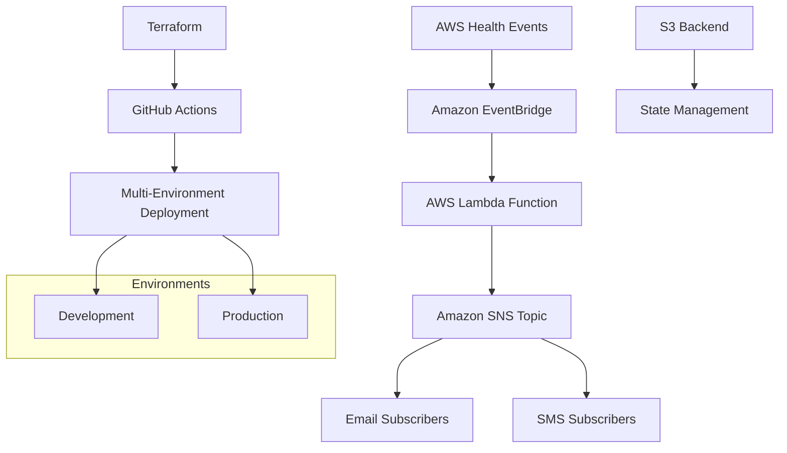

# AWS Health Event Notifications Infrastructure

<!-- Badges -->

[](https://terraform.io)
[](https://aws.amazon.com)
[](https://github.com/features/actions)
[](https://aws.amazon.com/lambda/)

[](https://www.terraform.io/)
[](https://registry.terraform.io/providers/hashicorp/aws/latest)
[](LICENSE)
[](http://makeapullrequest.com)

[](https://github.com/your-org/aws-health-notifications/graphs/commit-activity)
[](https://github.com/your-org/aws-health-notifications/issues)
[](https://github.com/your-org/aws-health-notifications/stargazers)

---

## 📋 Table of Contents

- [Overview](#-overview)
- [Features](#-features)
- [Architecture](#-architecture)
- [Project Structure](#-project-structure)
- [Prerequisites](#-prerequisites)
- [Quick Start](#-quick-start)
- [Configuration](#-configuration)
- [Deployment](#-deployment)
- [Testing](#-testing)
- [Monitoring](#-monitoring)
- [Troubleshooting](#-troubleshooting)
- [Maintenance](#-maintenance)
- [Contributing](#-contributing)
- [Security](#-security)
- [License](#-license)

## 🎯 Overview

This project automates AWS Health Event notifications using Terraform and GitHub Actions, supporting multiple environments with customizable email and SMS alerts. It provides real-time monitoring of AWS service health events with enhanced formatting and reliable delivery.

## ✨ Features

- 🔔 **Real-time AWS Health Event notifications**
- 📧 **Enhanced email formatting** with emojis and visual structure
- 📱 **SMS support** for critical alerts
- 🌍 **Multi-environment support** (dev/prod)
- 🔄 **Automated CI/CD deployments** via GitHub Actions
- 🔒 **Secure state management** with S3 backend
- 📝 **Custom message formatting** with Lambda function
- 🏗️ **Modular Terraform architecture**
- 🏷️ **Comprehensive resource tagging**
- 📊 **Resource grouping** for better organization
- 🛡️ **IAM least privilege** security model
- 🧹 **Clean project structure** with automated cleanup tools
- ⚡ **Environment-specific notification control** - Enable/disable alerts per environment

## 🏗️ Architecture



**Components:**

- **Amazon EventBridge**: Captures and filters AWS Health events
- **AWS Lambda**: Formats notifications with enhanced readability
- **Amazon SNS**: Manages notification distribution
- **Terraform**: Infrastructure as Code management
- **GitHub Actions**: Automated CI/CD pipeline

## 📁 Project Structure

```
📦 aws-health-notifications/
├── 🔧 .github/
│   └── workflows/
│       └── terraform.yml          # CI/CD pipeline configuration
├── 📋 backend/                    # Terraform backend configurations
│   ├── dev.hcl                   # Development backend config
│   └── prod.hcl                  # Production backend config
├── 🌍 environments/               # Environment-specific configurations
│   ├── dev/                      # Development environment
│   │   ├── main.tf               # Main Terraform configuration
│   │   ├── variables.tf          # Variable definitions
│   │   ├── outputs.tf            # Output definitions
│   │   ├── terraform.tfvars      # Environment-specific values
│   │   └── terraform.tfvars.example
│   └── prod/                     # Production environment
│       ├── main.tf               # Main Terraform configuration
│       ├── variables.tf          # Variable definitions
│       ├── outputs.tf            # Output definitions
│       ├── terraform.tfvars      # Environment-specific values
│       └── terraform.tfvars.example
├── 🧩 modules/                    # Reusable Terraform modules
│   ├── eventbridge/              # EventBridge & Lambda module
│   │   ├── lambda/
│   │   │   └── index.js          # Lambda notification formatter
│   │   ├── main.tf               # EventBridge resources
│   │   ├── variables.tf          # Module variables
│   │   ├── outputs.tf            # Module outputs
│   │   ├── versions.tf           # Terraform/provider versions
│   │   └── README.md             # Module documentation
│   ├── sns/                      # SNS notification module
│   │   ├── main.tf               # SNS topic & policies
│   │   ├── variables.tf          # Module variables
│   │   ├── outputs.tf            # Module outputs
│   │   ├── versions.tf           # Terraform/provider versions
│   │   └── README.md             # Module documentation
│   └── resource_groups/          # Resource organization module
│       ├── main.tf               # Resource group definitions
│       ├── variables.tf          # Module variables
│       ├── outputs.tf            # Module outputs
│       ├── versions.tf           # Terraform/provider versions
│       └── README.md             # Module documentation
├── 🧰 scripts/
│   ├── testing/
│   │   ├── test-health-notification.sh  # Test AWS Health notifications
│   │   └── test-lambda-formatter.sh     # Test Lambda function locally
│   └── utilities/
│       ├── cleanup-project.sh    # Clean up generated Terraform files
│       └── quick-cleanup.sh      # Quick cleanup utility
├── 📚 Documentation
│   ├── README.md                 # This file
│   ├── BOOTSTRAP.md              # Initial GitHub Actions setup guide
│   ├── deployment.md             # GitHub Actions deployment procedures
│   ├── TAGGING_STRATEGY.md       # Resource tagging guidelines
│   ├── CLAUDE.md                 # AI assistant project instructions
│   ├── .pre-commit-config.yaml   # Pre-commit hooks config
│   ├── .terraform-docs.yml       # Terraform-docs configuration
│   ├── .trivyignore              # Trivy security exceptions
│   └── .gitignore                # Git ignore rules
```

## 📋 Prerequisites

### Required Tools

- **AWS Account** with administrative access
- **Terraform** v1.0.0+ ([Install Guide](https://learn.hashicorp.com/tutorials/terraform/install-cli))
- **AWS CLI** v2.0+ ([Install Guide](https://docs.aws.amazon.com/cli/latest/userguide/getting-started-install.html))
- **Git** for version control
- **GitHub** repository with Actions enabled

### AWS Resources

- **S3 bucket** for Terraform state storage
- **IAM user/role** with appropriate permissions

### Permissions Required

```json
{
  "Version": "2012-10-17",
  "Statement": [
    {
      "Effect": "Allow",
      "Action": [
        "events:*",
        "lambda:*",
        "sns:*",
        "iam:*",
        "logs:*",
        "resource-groups:*",
        "s3:GetObject",
        "s3:PutObject"
      ],
      "Resource": "*"
    }
  ]
}
```

## 🚀 Quick Start

> **📘 For first-time setup, see [BOOTSTRAP.md](BOOTSTRAP.md) for detailed step-by-step instructions.**

### 1. Clone Repository

```bash
git clone https://github.com/your-org/aws-health-notifications.git
cd aws-health-notifications
```

### 2. Complete Bootstrap Setup

Follow the comprehensive setup guide: **[BOOTSTRAP.md](BOOTSTRAP.md)**

The bootstrap guide covers:
- ✅ Creating AWS S3 backend bucket
- ✅ Creating IAM user for GitHub Actions
- ✅ Configuring GitHub Secrets
- ✅ Setting up GitHub Environments (dev/prod)
- ✅ Configuring environment variables
- ✅ Initial deployment via GitHub Actions
- ✅ Setting up SNS subscriptions
- ✅ Testing the system

### 3. Quick Deploy (After Bootstrap)

Once bootstrap is complete, deploy changes via GitHub Actions:

```bash
# Create feature branch
git checkout -b feature/my-changes

# Make changes to code/configs
# ...

# Commit changes
git add .
git commit -m "feat: description of changes"

# Push and create PR
git push origin feature/my-changes

# Merge PR → Auto-deploys to dev
```

## ⚙️ Configuration

### Environment Variables

Create `terraform.tfvars` in each environment directory:

```hcl
# environments/dev/terraform.tfvars
aws_region     = "us-east-1"
environment    = "dev"
owner_team     = "platform-team"
cost_center    = "engineering"

# GitHub repository information
github_org     = "your-org"
github_repo    = "aws-health-notifications"

# Custom tags
tags = {
  CostCenter  = "platform-engineering"
  Owner       = "devops-team"
  Criticality = "high"
}
```

### EventBridge Notification Control

Each environment can independently enable or disable AWS Health notifications. This is useful for:
- Disabling dev environment alerts during normal operations
- Enabling dev only when testing notification workflows
- Keeping production alerts always active

**Configuration:**

In `environments/dev/main.tf`:
```hcl
module "eventbridge" {
  source = "../../modules/eventbridge"

  environment   = var.environment
  sns_topic_arn = module.sns.topic_arn
  enabled       = false  # Disable dev notifications (default: true)
  tags          = local.resource_tags
}
```

**Usage:**
- Set `enabled = false` to disable EventBridge rule (no notifications sent)
- Set `enabled = true` to enable EventBridge rule (notifications active)
- Default value is `true` if not specified

### SNS Subscriptions

Subscriptions are managed manually via AWS Console for flexibility:

**Email Subscription:**

1. Go to **SNS Console** → Topics
2. Select `{environment}-health-event-notifications`
3. **Create subscription**:
   - Protocol: `Email`
   - Endpoint: `your-email@company.com`
4. Confirm via email

**SMS Subscription:**

1. **Create subscription**:
   - Protocol: `SMS`
   - Endpoint: `+1234567890` (E.164 format)

## 🚢 Deployment

> **⚠️ CRITICAL: All deployments MUST be done via GitHub Actions**
>
> Local Terraform deployments are **PROHIBITED** to prevent:
> - State conflicts between local and CI/CD environments
> - Inconsistent tfvars configurations
> - Bypassing deployment approvals and audit trail
> - Breaking the automated deployment pipeline
>
> If you need to test Terraform locally, use `terraform plan` only (never `terraform apply`).

### GitHub Actions Deployment (REQUIRED)

**Development Environment:**

```bash
# Automatic deployment on merge to main
git checkout -b feature/my-changes
# ... make changes ...
git commit -m "feat: my changes"
git push origin feature/my-changes
# Create PR → Merge to main → Auto-deploys to dev
```

**Production Environment:**

```bash
# Manual workflow dispatch with approval gate
# 1. Go to: GitHub → Actions → "Terraform CI/CD" workflow
# 2. Click "Run workflow"
# 3. Select environment: "prod"
# 4. Click "Run workflow"
# 5. Approve deployment when prompted
```

### Local Testing (Plan Only)

For local validation before pushing (optional):

```bash
# Initialize (read-only)
cd environments/dev
terraform init -backend-config=../../backend/dev.hcl

# Plan only (safe - no changes applied)
terraform plan -var-file="terraform.tfvars"

# NEVER run terraform apply locally
```

## 🧪 Testing

### Test Health Event Notifications

```bash
# Test development environment
./scripts/testing/test-health-notification.sh dev

# Test production environment
./scripts/testing/test-health-notification.sh prod
```

### Test Lambda Function Locally

```bash
# Test message formatting
./scripts/testing/test-lambda-formatter.sh
```

### Manual Testing

```bash
# Create test event
aws events put-events \
  --entries '[{
    "Source": "aws.health",
    "DetailType": "AWS Health Event",
    "Detail": "{\"service\":\"EC2\",\"statusCode\":\"open\"}"
  }]'
```

## 📊 Monitoring

### CloudWatch Dashboards

Access pre-built dashboards for:

- **Lambda Performance**: Function duration, errors, invocations
- **SNS Metrics**: Delivery success/failure rates
- **EventBridge**: Rule matches and failures

### Key Metrics to Monitor

- Lambda function errors and duration
- SNS delivery success rate
- EventBridge rule matches
- Overall notification delivery rate

### Alerting

Set up CloudWatch alarms for:

- Lambda function failures > 5%
- SNS delivery failures > 10%
- EventBridge processing delays > 5 minutes

## 📖 Documentation

### Module Documentation

Each Terraform module includes comprehensive documentation:

- **EventBridge Module**: See `modules/eventbridge/README.md`
- **SNS Module**: See `modules/sns/README.md`
- **Resource Groups Module**: See `modules/resource_groups/README.md`

Module documentation is automatically generated using [terraform-docs](https://terraform-docs.io/) and includes:
- Module overview and features
- Usage examples
- Input variables reference
- Output values reference
- Resource details

### Generating Documentation

Documentation is automatically updated via pre-commit hooks:

```bash
# Install pre-commit (if not already installed)
brew install pre-commit  # macOS
# or
pip install pre-commit   # Python

# Install pre-commit hooks
pre-commit install

# Manually run all hooks
pre-commit run --all-files

# Run only terraform-docs
pre-commit run terraform_docs --all-files
```

The terraform-docs hook will:
1. Scan all module directories for Terraform files
2. Generate markdown documentation from code
3. Inject documentation between `<!-- BEGIN_TF_DOCS -->` and `<!-- END_TF_DOCS -->` markers
4. Preserve custom content outside these markers

### Pre-Commit Hooks

This project uses pre-commit hooks for code quality:

- **terraform_fmt**: Formats Terraform code to canonical format
- **terraform_validate**: Validates Terraform configuration
- **terraform_docs**: Generates module documentation
- **terraform_tflint**: Lints Terraform for best practices
- **terraform_trivy**: Scans for security issues
- **General hooks**: Trailing whitespace, YAML syntax, large files, AWS credentials detection

## 🔧 Maintenance

### Project Cleanup

Use the built-in cleanup utility to remove generated Terraform files:

```bash
# Run the cleanup script
./scripts/utilities/cleanup-project.sh

# Or quick cleanup
./scripts/utilities/quick-cleanup.sh
```

This will safely remove:
- Generated Terraform files (`.terraform/` directories)
- Terraform lock files
- Lambda function ZIP archives
- Temporary files

### Regular Maintenance Tasks

- **Monthly**: Review and update dependencies
- **Quarterly**: Security assessment and updates
- **As needed**: Clean up generated files using cleanup scripts

### Terraform State Management

State is managed automatically by GitHub Actions. For local validation:

```bash
# Reinitialize Terraform (read-only)
cd environments/dev
terraform init -backend-config=../../backend/dev.hcl -reconfigure

# Check state health (read-only)
terraform plan -var-file="terraform.tfvars"

# Return to root
cd ../..
```

**⚠️ Remember: Never run `terraform apply` locally - use GitHub Actions**

## 🔍 Troubleshooting

### Common Issues

| Issue                         | Symptoms                 | Solution                                               |
| ----------------------------- | ------------------------ | ------------------------------------------------------ |
| **No notifications received** | Events not triggering    | Check EventBridge rule state, Lambda logs, SNS subscriptions |
| **EventBridge rule disabled** | No events being captured | Verify `enabled` parameter in environment module config |
| **Lambda timeout**            | Function exceeding 30s   | Check CloudWatch logs, optimize code                   |
| **Permission errors**         | Access denied messages   | Verify IAM roles and policies                          |
| **State lock errors**         | Terraform lock conflicts | Check S3 backend configuration                         |

### Debug Commands

```bash
# Check Lambda logs
aws logs describe-log-groups --log-group-name-prefix "/aws/lambda/"

# Test SNS topic
aws sns publish --topic-arn "arn:aws:sns:region:account:topic" --message "test"

# Check EventBridge rule state
aws events describe-rule --name "dev-health-event-notifications" \
  --region us-east-1 \
  --query '{Name:Name, State:State, Description:Description}'

# Verify EventBridge rule is enabled/disabled as expected
# State should be "ENABLED" or "DISABLED" based on your configuration
```

### Log Analysis

```bash
# Stream Lambda logs
aws logs tail /aws/lambda/dev-health-event-formatter --follow

# Search for errors
aws logs filter-log-events \
  --log-group-name "/aws/lambda/dev-health-event-formatter" \
  --filter-pattern "ERROR"
```

## 🤝 Contributing

### Development Workflow

1. **Fork** the repository
2. **Create** a feature branch: `git checkout -b feature/amazing-feature`
3. **Make** changes and test thoroughly
4. **Run** cleanup: `./scripts/utilities/cleanup-project.sh` (if needed)
5. **Commit** with conventional commits: `git commit -m 'feat: add amazing feature'`
6. **Push** to branch: `git push origin feature/amazing-feature`
7. **Create** a Pull Request
8. **Review** automated Terraform plan in PR checks
9. **Merge** after approval → Deploys to dev automatically

### Code Standards

- Follow [Terraform best practices](https://www.terraform-best-practices.com/)
- Use consistent naming conventions
- Add comments for complex logic
- Update documentation for changes
- Test in `dev` before `prod`
- Keep the project structure clean

### Commit Message Format

```
<type>(<scope>): <description>

[optional body]

[optional footer]
```

**Types:** `feat`, `fix`, `docs`, `style`, `refactor`, `test`, `chore`

## 🛡️ Security

### Security Best Practices

- **Least Privilege**: IAM roles follow minimum required permissions
- **Encryption**: SNS topics support encryption at rest
- **State Security**: Terraform state stored securely in S3
- **Access Control**: GitHub environments protect production
- **Audit Trail**: All changes tracked via Git and CloudTrail

### Security Checklist

- [ ] IAM roles follow least privilege
- [ ] SNS topics encrypted
- [ ] S3 bucket encryption enabled
- [ ] GitHub secrets properly configured
- [ ] CloudTrail logging enabled
- [ ] Regular security reviews

### Vulnerability Reporting

Report security vulnerabilities to: [security@company.com](mailto:security@company.com)

## 📄 License

This project is licensed under the MIT License - see the [LICENSE](LICENSE) file for details.

## 📞 Support

### Getting Help

- **Documentation**: Check this README and [deployment.md](deployment.md)
- **Issues**: [GitHub Issues](https://github.com/your-org/aws-health-notifications/issues)
- **Discussions**: [GitHub Discussions](https://github.com/your-org/aws-health-notifications/discussions)
- **Internal**: Contact the Platform Team on Slack

### Maintenance Schedule

- **Regular Updates**: Monthly dependency updates via GitHub Actions
- **Security Patches**: As needed via GitHub Actions
- **Feature Releases**: Quarterly via GitHub Actions
- **Cleanup**: Use `./scripts/utilities/cleanup-project.sh` for local cleanup as needed

---

## 📈 Roadmap

- [ ] **Enhanced Monitoring**: Advanced CloudWatch dashboards
- [ ] **Multi-Region Support**: Cross-region deployment capability
- [ ] **Slack Integration**: Slack webhook notifications
- [ ] **Custom Filters**: Advanced event filtering options
- [ ] **Cost Optimization**: Lambda provisioned concurrency options
- [ ] **Testing Framework**: Automated integration tests
- [ ] **Terraform Modules**: Publish reusable modules

---

**Made with ❤️ by the Platform Team**

_For more information, visit our [internal documentation](https://docs.company.com/aws-health-notifications)_
