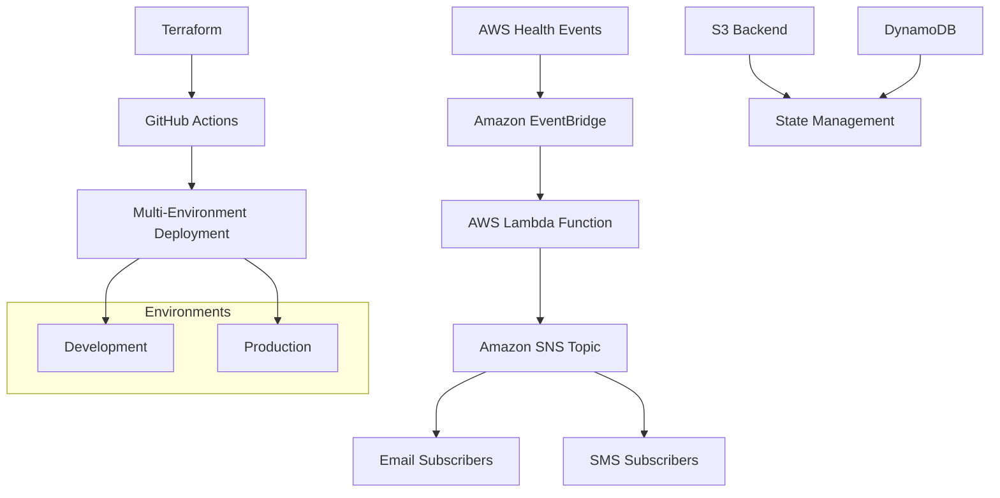
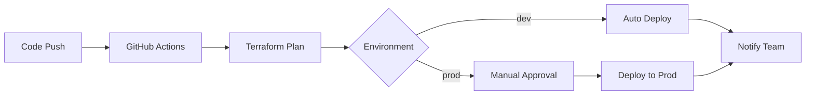

# AWS Health Event Notifications Infrastructure

<!-- Badges -->

[](https://terraform.io)
[](https://aws.amazon.com)
[](https://github.com/features/actions)
[](https://aws.amazon.com/lambda/)

[](https://www.terraform.io/)
[](https://registry.terraform.io/providers/hashicorp/aws/latest)
[](LICENSE)
[](http://makeapullrequest.com)

[](https://github.com/your-org/aws-health-notifications/graphs/commit-activity)
[](https://github.com/your-org/aws-health-notifications/issues)
[](https://github.com/your-org/aws-health-notifications/stargazers)

---

## 📋 Table of Contents

- [Overview](#-overview)
- [Features](#-features)
- [Architecture](#-architecture)
- [Project Structure](#-project-structure)
- [Prerequisites](#-prerequisites)
- [Quick Start](#-quick-start)
- [Configuration](#-configuration)
- [Deployment](#-deployment)
- [Testing](#-testing)
- [Monitoring](#-monitoring)
- [Troubleshooting](#-troubleshooting)
- [Contributing](#-contributing)
- [Security](#-security)
- [License](#-license)

## 🎯 Overview

This project automates AWS Health Event notifications using Terraform and GitHub Actions, supporting multiple environments with customizable email and SMS alerts. It provides real-time monitoring of AWS service health events with enhanced formatting and reliable delivery.

## ✨ Features

- 🔔 **Real-time AWS Health Event notifications**
- 📧 **Enhanced email formatting** with emojis and visual structure
- 📱 **SMS support** for critical alerts
- 🌍 **Multi-environment support** (dev/prod/staging)
- 🔄 **Automated CI/CD deployments** via GitHub Actions
- 🔒 **Secure state management** with S3 and DynamoDB
- 📝 **Custom message formatting** with Lambda function
- 🏗️ **Modular Terraform architecture**
- 🏷️ **Comprehensive resource tagging**
- 📊 **Resource grouping** for better organization
- 🛡️ **IAM least privilege** security model

## 🏗️ Architecture



**Components:**

- **Amazon EventBridge**: Captures and filters AWS Health events
- **AWS Lambda**: Formats notifications with enhanced readability
- **Amazon SNS**: Manages notification distribution
- **Terraform**: Infrastructure as Code management
- **GitHub Actions**: Automated CI/CD pipeline

## 📁 Project Structure

```
├── 📁 .github/
│   └── 📁 workflows/
│       └── 📄 terraform.yml          # CI/CD pipeline
├── 📁 backend/                       # Backend configurations
│   ├── 📄 dev.hcl
│   └── 📄 prod.hcl
├── 📁 environments/                  # Environment-specific configs
│   ├── 📁 dev/
│   │   ├── 📄 main.tf
│   │   ├── 📄 variables.tf
│   │   ├── 📄 outputs.tf
│   │   └── 📄 terraform.tfvars.example
│   └── 📁 prod/
│       ├── 📄 main.tf
│       ├── 📄 variables.tf
│       ├── 📄 outputs.tf
│       └── 📄 terraform.tfvars.example
├── 📁 modules/                       # Reusable Terraform modules
│   ├── 📁 eventbridge/              # Event processing & Lambda
│   │   ├── 📁 lambda/
│   │   │   └── 📄 index.js          # Notification formatter
│   │   ├── 📄 main.tf
│   │   ├── 📄 variables.tf
│   │   └── 📄 outputs.tf
│   ├── 📁 sns/                      # Notification management
│   │   ├── 📄 main.tf
│   │   ├── 📄 variables.tf
│   │   └── 📄 outputs.tf
│   └── 📁 resource_groups/          # Resource organization
│       ├── 📄 main.tf
│       ├── 📄 variables.tf
│       └── 📄 outputs.tf
├── 📄 README.md
├── 📄 TAGGING_STRATEGY.md           # Tagging guidelines
├── 📄 deployment.md                 # Deployment procedures
├── 📄 .gitignore
├── 📄 init.sh                       # Environment initialization
├── 📄 deploy.sh                     # Deployment helper
└── 📄 test-*.sh                     # Testing scripts
```

## 📋 Prerequisites

### Required Tools

- **AWS Account** with administrative access
- **Terraform** v1.0.0+ ([Install Guide](https://learn.hashicorp.com/tutorials/terraform/install-cli))
- **AWS CLI** v2.0+ ([Install Guide](https://docs.aws.amazon.com/cli/latest/userguide/getting-started-install.html))
- **Git** for version control
- **GitHub** repository with Actions enabled

### AWS Resources

- **S3 bucket** for Terraform state storage
- **DynamoDB table** for state locking
- **IAM user/role** with appropriate permissions

### Permissions Required

```json
{
  "Version": "2012-10-17",
  "Statement": [
    {
      "Effect": "Allow",
      "Action": [
        "events:*",
        "lambda:*",
        "sns:*",
        "iam:*",
        "logs:*",
        "resource-groups:*",
        "s3:*",
        "dynamodb:*"
      ],
      "Resource": "*"
    }
  ]
}
```

## 🚀 Quick Start

### 1. Clone Repository

```bash
git clone https://github.com/your-org/aws-health-notifications.git
cd aws-health-notifications
```

### 2. Configure GitHub Secrets

Navigate to your repository settings and add these secrets:

| Secret Name             | Description         | Example              |
| ----------------------- | ------------------- | -------------------- |
| `AWS_ACCESS_KEY_ID`     | AWS Access Key      | `AKIA...`            |
| `AWS_SECRET_ACCESS_KEY` | AWS Secret Key      | `xxxx...`            |
| `TF_STATE_BUCKET`       | S3 bucket for state | `my-terraform-state` |
| `TF_STATE_LOCK_TABLE`   | DynamoDB table      | `terraform-locks`    |

### 3. Configure Environments

Set up GitHub environments:

- Navigate to **Settings** → **Environments**
- Create `dev` and `prod` environments
- Configure protection rules for `prod`

### 4. Initialize Development Environment

```bash
./init.sh dev
```

### 5. Deploy

```bash
# Deploy to development
./deploy.sh dev

# Or deploy via GitHub Actions
git push origin main  # Auto-deploys to dev
```

## ⚙️ Configuration

### Environment Variables

Create `terraform.tfvars` in each environment directory:

```hcl
# environments/dev/terraform.tfvars
aws_region     = "us-east-1"
environment    = "dev"
owner_team     = "platform-team"
cost_center    = "engineering"

# Custom tags
tags = {
  CostCenter  = "platform-engineering"
  Owner       = "devops-team"
  Criticality = "high"
}
```

### SNS Subscriptions

Subscriptions are managed manually via AWS Console for flexibility:

**Email Subscription:**

1. Go to **SNS Console** → Topics
2. Select `{environment}-health-event-notifications`
3. **Create subscription**:
   - Protocol: `Email`
   - Endpoint: `your-email@company.com`
4. Confirm via email

**SMS Subscription:**

1. **Create subscription**:
   - Protocol: `SMS`
   - Endpoint: `+1234567890` (E.164 format)

## 🚢 Deployment

### Automated Deployment (Recommended)

**Development:**

```bash
# Automatic on main branch push
git push origin main
```

**Production:**

```bash
# Manual trigger with approval
# Go to GitHub Actions → Run workflow → Select 'prod'
```

### Manual Deployment

```bash
# Initialize
cd environments/dev
terraform init -backend-config=../../backend/dev.hcl

# Plan
terraform plan -var-file="terraform.tfvars"

# Apply
terraform apply -var-file="terraform.tfvars"
```

### Deployment Pipeline



## 🧪 Testing

### Test Health Event Notifications

```bash
# Test development environment
./test-health-notification.sh dev

# Test production environment
./test-health-notification.sh prod
```

### Test Lambda Function

```bash
# Test message formatting
./test-lambda-formatter.sh
```

### Manual Testing

```bash
# Create test event
aws events put-events \
  --entries '[{
    "Source": "aws.health",
    "DetailType": "AWS Health Event",
    "Detail": "{\"service\":\"EC2\",\"statusCode\":\"open\"}"
  }]'
```

## 📊 Monitoring

### CloudWatch Dashboards

Access pre-built dashboards:

- **Lambda Performance**: Function duration, errors, invocations
- **SNS Metrics**: Delivery success/failure rates
- **EventBridge**: Rule matches and failures

### Key Metrics to Monitor

- Lambda function errors and duration
- SNS delivery success rate
- EventBridge rule matches
- DLQ message count (if implemented)

### Alerting

Set up CloudWatch alarms for:

- Lambda function failures > 5%
- SNS delivery failures > 10%
- EventBridge processing delays > 5 minutes

## 🔍 Troubleshooting

### Common Issues

| Issue                         | Symptoms                 | Solution                                               |
| ----------------------------- | ------------------------ | ------------------------------------------------------ |
| **No notifications received** | Events not triggering    | Check EventBridge rule, Lambda logs, SNS subscriptions |
| **Lambda timeout**            | Function exceeding 30s   | Check CloudWatch logs, optimize code                   |
| **Permission errors**         | Access denied messages   | Verify IAM roles and policies                          |
| **State lock errors**         | Terraform lock conflicts | Check DynamoDB table, release locks                    |

### Debug Commands

```bash
# Check Lambda logs
aws logs describe-log-groups --log-group-name-prefix "/aws/lambda/"

# Test SNS topic
aws sns publish --topic-arn "arn:aws:sns:region:account:topic" --message "test"

# Validate EventBridge rule
aws events describe-rule --name "dev-health-event-notifications"
```

### Log Analysis

```bash
# Stream Lambda logs
aws logs tail /aws/lambda/dev-health-event-formatter --follow

# Search for errors
aws logs filter-log-events \
  --log-group-name "/aws/lambda/dev-health-event-formatter" \
  --filter-pattern "ERROR"
```

## 🤝 Contributing

### Development Workflow

1. **Fork** the repository
2. **Create** a feature branch: `git checkout -b feature/amazing-feature`
3. **Make** changes and test thoroughly
4. **Commit** with conventional commits: `git commit -m 'feat: add amazing feature'`
5. **Push** to branch: `git push origin feature/amazing-feature`
6. **Create** a Pull Request

### Code Standards

- Follow [Terraform best practices](https://www.terraform-best-practices.com/)
- Use consistent naming conventions
- Add comments for complex logic
- Update documentation for changes
- Test in `dev` before `prod`

### Commit Message Format

```
<type>(<scope>): <description>

[optional body]

[optional footer]
```

**Types:** `feat`, `fix`, `docs`, `style`, `refactor`, `test`, `chore`

## 🛡️ Security

### Security Best Practices

- **Least Privilege**: IAM roles follow minimum required permissions
- **Encryption**: SNS topics support encryption at rest
- **State Security**: Terraform state encrypted in S3
- **Access Control**: GitHub environments protect production
- **Audit Trail**: All changes tracked via Git and CloudTrail

### Security Checklist

- [ ] IAM roles follow least privilege
- [ ] SNS topics encrypted
- [ ] S3 bucket encryption enabled
- [ ] GitHub secrets properly configured
- [ ] CloudTrail logging enabled
- [ ] Regular security reviews

### Vulnerability Reporting

Report security vulnerabilities to: [security@company.com](mailto:security@company.com)

## 📄 License

This project is licensed under the MIT License - see the [LICENSE](LICENSE) file for details.

## 📞 Support

### Getting Help

- **Documentation**: Check this README and [deployment.md](deployment.md)
- **Issues**: [GitHub Issues](https://github.com/your-org/aws-health-notifications/issues)
- **Discussions**: [GitHub Discussions](https://github.com/your-org/aws-health-notifications/discussions)
- **Internal**: Contact the Platform Team on Slack

### Maintenance Schedule

- **Regular Updates**: Monthly dependency updates
- **Security Patches**: As needed
- **Feature Releases**: Quarterly

---

## 📈 Roadmap

- [ ] **Enhanced Monitoring**: CloudWatch dashboards and alarms
- [ ] **Multi-Region Support**: Cross-region deployment capability
- [ ] **Slack Integration**: Slack webhook notifications
- [ ] **Custom Filters**: Advanced event filtering options
- [ ] **Cost Optimization**: Lambda provisioned concurrency options
- [ ] **Testing Framework**: Automated integration tests

---

**Made with ❤️ by the Platform Team**

_For more information, visit our [internal documentation](https://docs.company.com/aws-health-notifications)_
